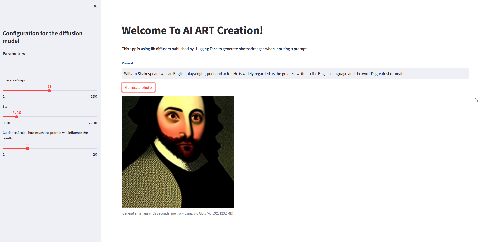

# ImageGenerationDemo
This is the demo for image generation using Lib Diffusers of the HuggingFace

## Installation
Install library diffusers from HuggingFace: ```pip install diffusers```
[Hugging Face Diffusers on Github](https://github.com/huggingface/diffusers)

Install streamlit lib: ```pip install streamlit```

Or install using my ```requirement.txt```

## Run app
I wrote an application using streamlit for people to try the code, you can go to your local ip ```local:8501``` to use it. The baseic app looks as below 
<p align="center">
    <br>
    
    <br>
<p>

You could change the parameters on the sidebar of the app. To understand the insight of params, please take a look into: [ldm-text2im-large-256](https://huggingface.co/CompVis/ldm-text2im-large-256) at [huggingface.co](https://huggingface.co)

